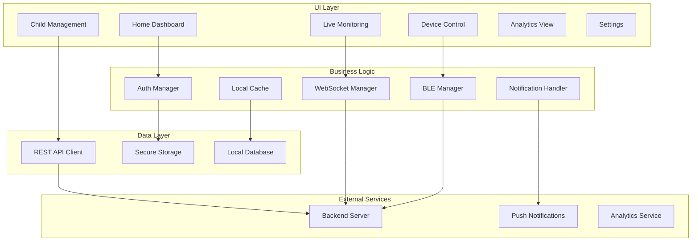
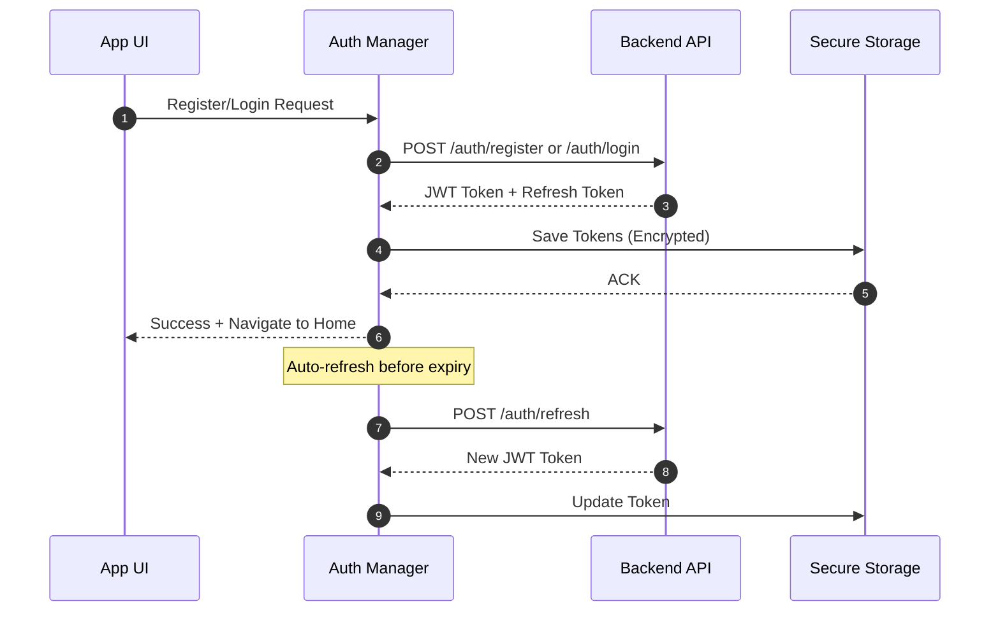
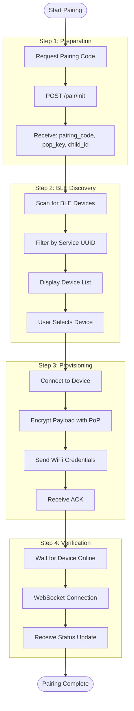
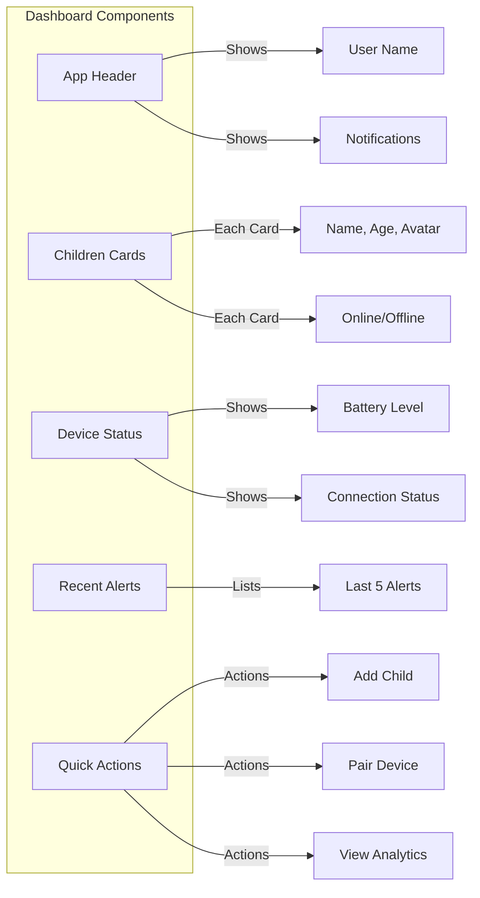
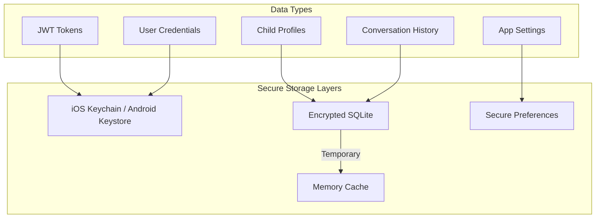
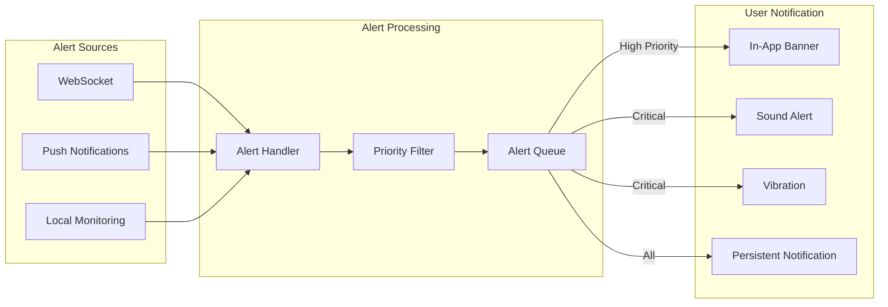
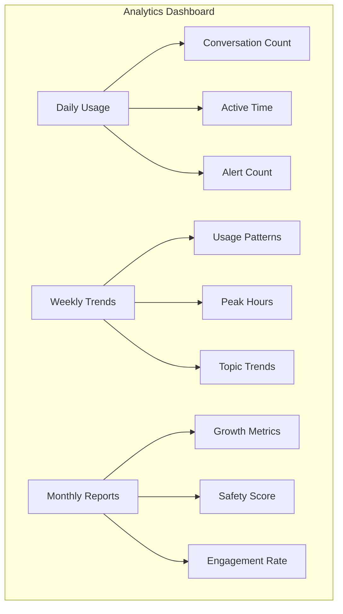
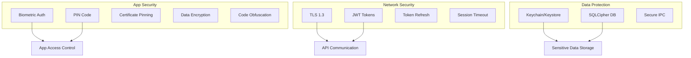
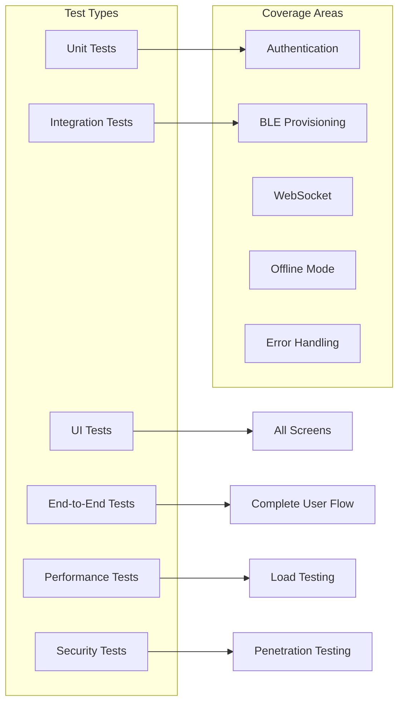
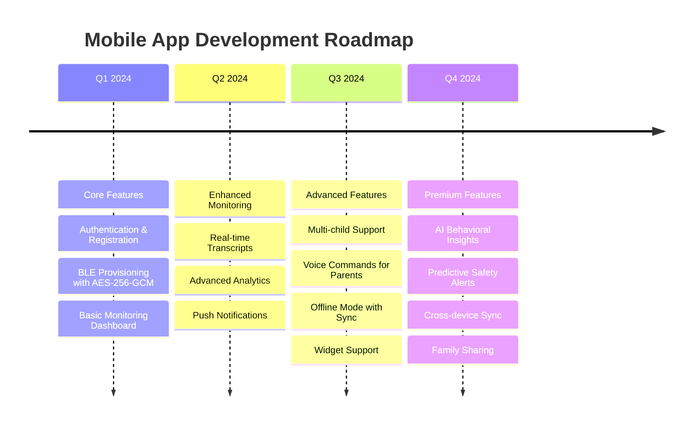

# 📱 AI Teddy Bear Mobile Application - وثائق النظام التقنية

## 1. نظرة عامة على التطبيق

تطبيق الوالدين هو واجهة التحكم والمراقبة الرئيسية لنظام AI Teddy Bear، يوفر إدارة كاملة للأطفال والأجهزة مع مراقبة أمنية في الوقت الفعلي.

### المنصات المدعومة
- **iOS**: 14.0+ (Swift 5.5+)
- **Android**: API 26+ (Kotlin 1.8+)
- **Framework**: React Native / Flutter (حسب الاختيار)

### الميزات الأساسية
- إقران الأجهزة عبر BLE
- مراقبة المحادثات في الوقت الفعلي
- التنبيهات الأمنية الفورية
- إدارة ملفات الأطفال
- التحليلات والتقارير
- إعدادات الخصوصية والأمان

## 2. البنية المعمارية



## 3. تدفق العمليات الأساسية

### 3.1 عملية التسجيل والدخول



### 3.2 عملية إقران الجهاز (Device Pairing)



## 4. واجهات المستخدم (UI Screens)

### 4.1 الشاشة الرئيسية (Dashboard)



### 4.2 شاشة المراقبة المباشرة

```typescript
interface MonitoringScreen {
  components: {
    liveTranscript: TranscriptView;      // عرض المحادثة المباشرة
    audioWaveform: WaveformVisualizer;   // مؤشر الصوت
    safetyIndicator: SafetyStatus;       // حالة الأمان
    alertsPanel: AlertsPanel;            // لوحة التنبيهات
    controlButtons: ControlPanel;        // أزرار التحكم
  };
  
  realTimeData: {
    conversationText: string[];
    audioLevel: number;
    safetyScore: number;
    activeAlerts: Alert[];
  };
}
```

## 5. إدارة البيانات

### 5.1 نموذج البيانات المحلية

```typescript
// Child Entity
interface Child {
  id: string;                    // UUID
  name: string;
  age: number;
  avatar?: string;               // Base64 or URL
  createdAt: Date;
  settings: ChildSettings;
}

// Device Entity
interface Device {
  id: string;                    // Device UUID
  childId: string;               // Associated Child
  name: string;                  // Custom name
  status: 'online' | 'offline';
  batteryLevel?: number;
  lastSeen: Date;
  firmwareVersion: string;
}

// Conversation Entity
interface Conversation {
  id: string;
  childId: string;
  deviceId: string;
  startTime: Date;
  endTime?: Date;
  transcript: Message[];
  alerts: Alert[];
}

// Alert Entity
interface Alert {
  id: string;
  childId: string;
  timestamp: Date;
  severity: 'low' | 'medium' | 'high' | 'critical';
  type: string;
  message: string;
  acknowledged: boolean;
}
```

### 5.2 التخزين الآمن



## 6. الاتصال بالخادم

### 6.1 REST API Integration

```typescript
class APIClient {
  private baseURL = "https://api.ai-teddy.com";
  private token: string;
  
  // Authentication
  async login(email: string, password: string): Promise<AuthResponse> {
    return this.post('/auth/login', { email, password });
  }
  
  // Pairing
  async initiatePairing(parentId: string, child: ChildData): Promise<PairingResponse> {
    return this.post('/pair/init', { parent_id: parentId, child }, {
      headers: { 'Authorization': `Bearer ${this.token}` }
    });
  }
  
  // Child Management
  async getChildren(): Promise<Child[]> {
    return this.get('/children', {
      headers: { 'Authorization': `Bearer ${this.token}` }
    });
  }
  
  async updateChildSettings(childId: string, settings: ChildSettings): Promise<void> {
    return this.patch(`/children/${childId}/settings`, settings, {
      headers: { 'Authorization': `Bearer ${this.token}` }
    });
  }
}
```

### 6.2 WebSocket للمراقبة المباشرة

```typescript
class MonitoringWebSocket {
  private ws: WebSocket;
  private reconnectAttempts = 0;
  
  connect(parentId: string, childId: string, token: string) {
    const url = `wss://api.ai-teddy.com/parent/notify?parent_id=${parentId}&child_id=${childId}&auth=${token}`;
    
    this.ws = new WebSocket(url);
    
    this.ws.onopen = () => {
      console.log('Monitoring connected');
      this.reconnectAttempts = 0;
    };
    
    this.ws.onmessage = (event) => {
      const message = JSON.parse(event.data);
      this.handleMessage(message);
    };
    
    this.ws.onerror = (error) => {
      console.error('WebSocket error:', error);
      this.reconnect();
    };
  }
  
  private handleMessage(message: WSMessage) {
    switch(message.type) {
      case 'child_status':
        this.updateChildStatus(message);
        break;
      case 'security_alert':
        this.showSecurityAlert(message);
        break;
      case 'conversation_event':
        this.updateConversation(message);
        break;
    }
  }
  
  private reconnect() {
    if (this.reconnectAttempts < 5) {
      setTimeout(() => {
        this.reconnectAttempts++;
        this.connect();
      }, Math.pow(2, this.reconnectAttempts) * 1000);
    }
  }
}
```

## 7. BLE Provisioning

### 7.1 BLE Service Configuration

```swift
// iOS Implementation (Swift)
class BLEProvisioningManager {
    let serviceUUID = CBUUID(string: "6E400001-B5A3-F393-E0A9-E50E24DCCA9E")
    let writeCharUUID = CBUUID(string: "6E400002-B5A3-F393-E0A9-E50E24DCCA9E")
    let notifyCharUUID = CBUUID(string: "6E400003-B5A3-F393-E0A9-E50E24DCCA9E")
    
    func provisionDevice(ssid: String, 
                        password: String, 
                        childId: String, 
                        pairingCode: String,
                        popKey: String) {
        
        // 1. Create payload
        let payload = [
            "ssid": ssid,
            "password": password,
            "child_id": childId,
            "pairing_code": pairingCode
        ]
        
        // 2. Encrypt with PoP key
        let encryptedData = encrypt(payload, withKey: popKey)
        
        // 3. Write to characteristic
        peripheral.writeValue(encryptedData, 
                            for: writeCharacteristic,
                            type: .withResponse)
    }
    
    func peripheral(_ peripheral: CBPeripheral, 
                   didUpdateValueFor characteristic: CBCharacteristic, 
                   error: Error?) {
        
        guard let data = characteristic.value else { return }
        let response = try? JSONDecoder().decode(BLEResponse.self, from: data)
        
        if response?.status == "ok" {
            // Provisioning successful
            onProvisioningSuccess()
        }
    }
}
```

```kotlin
// Android Implementation (Kotlin)
class BLEProvisioningManager(private val context: Context) {
    companion object {
        val SERVICE_UUID = UUID.fromString("6E400001-B5A3-F393-E0A9-E50E24DCCA9E")
        val WRITE_CHAR_UUID = UUID.fromString("6E400002-B5A3-F393-E0A9-E50E24DCCA9E")
        val NOTIFY_CHAR_UUID = UUID.fromString("6E400003-B5A3-F393-E0A9-E50E24DCCA9E")
    }
    
    fun provisionDevice(
        device: BluetoothDevice,
        ssid: String,
        password: String,
        childId: String,
        pairingCode: String,
        popKey: String
    ) {
        val gatt = device.connectGatt(context, false, gattCallback)
        
        // Create and encrypt payload
        val payload = JSONObject().apply {
            put("ssid", ssid)
            put("password", password)
            put("child_id", childId)
            put("pairing_code", pairingCode)
        }
        
        val encryptedData = encrypt(payload.toString(), popKey)
        
        // Write to characteristic
        val characteristic = gatt.getService(SERVICE_UUID)
            ?.getCharacteristic(WRITE_CHAR_UUID)
        
        characteristic?.value = encryptedData
        gatt.writeCharacteristic(characteristic)
    }
}
```

## 8. التنبيهات والإشعارات

### 8.1 نظام التنبيهات



### 8.2 أنواع التنبيهات

```typescript
enum AlertType {
  // Safety Alerts
  INAPPROPRIATE_CONTENT = 'inappropriate_content',
  PII_DETECTED = 'pii_detected',
  STRANGER_DANGER = 'stranger_danger',
  
  // System Alerts
  DEVICE_OFFLINE = 'device_offline',
  LOW_BATTERY = 'low_battery',
  CONNECTION_LOST = 'connection_lost',
  
  // Activity Alerts
  CONVERSATION_STARTED = 'conversation_started',
  LONG_CONVERSATION = 'long_conversation',
  UNUSUAL_ACTIVITY = 'unusual_activity'
}

interface AlertHandler {
  handleAlert(alert: Alert): void {
    switch(alert.severity) {
      case 'critical':
        this.showImmediateNotification(alert);
        this.playAlarmSound();
        this.vibrateDevice();
        break;
      case 'high':
        this.showNotification(alert);
        this.playNotificationSound();
        break;
      case 'medium':
        this.showInAppBanner(alert);
        break;
      case 'low':
        this.addToNotificationCenter(alert);
        break;
    }
    
    // Log to analytics
    this.logAlertToAnalytics(alert);
    
    // Store in database
    this.storeAlert(alert);
  }
}
```

## 9. التحليلات والتقارير

### 9.1 لوحة التحليلات



### 9.2 نماذج البيانات التحليلية

```typescript
interface AnalyticsData {
  dailyMetrics: {
    date: Date;
    conversationCount: number;
    totalMinutes: number;
    alertCount: number;
    safetyScore: number;
    topics: TopicFrequency[];
  };
  
  weeklyTrends: {
    weekStart: Date;
    avgDailyUsage: number;
    peakHours: HourlyDistribution;
    topTopics: string[];
    alertTrend: 'increasing' | 'decreasing' | 'stable';
  };
  
  monthlyReport: {
    month: string;
    totalConversations: number;
    totalHours: number;
    alertsSummary: AlertSummary;
    developmentMilestones: Milestone[];
    recommendations: string[];
  };
}

class AnalyticsService {
  async generateDailyReport(childId: string, date: Date): Promise<DailyMetrics> {
    const conversations = await this.getConversations(childId, date);
    const alerts = await this.getAlerts(childId, date);
    
    return {
      conversationCount: conversations.length,
      totalMinutes: this.calculateTotalMinutes(conversations),
      alertCount: alerts.length,
      safetyScore: this.calculateSafetyScore(alerts),
      topics: this.extractTopics(conversations)
    };
  }
}
```

## 10. إعدادات الخصوصية والأمان

### 10.1 إعدادات الخصوصية

```typescript
interface PrivacySettings {
  dataRetention: {
    conversationHistory: '7days' | '30days' | '90days' | 'never';
    audioRecordings: 'never' | '24hours' | '7days';
    analyticsData: '30days' | '90days' | '1year';
  };
  
  dataSharing: {
    shareAnalytics: boolean;
    shareCrashReports: boolean;
    improveAI: boolean;
  };
  
  notifications: {
    criticalAlerts: boolean;  // Always true
    highAlerts: boolean;
    mediumAlerts: boolean;
    lowAlerts: boolean;
    marketingNotifications: boolean;
  };
  
  security: {
    biometricAuth: boolean;
    pinCode?: string;
    autoLockTimeout: number;  // minutes
    encryptLocalData: boolean;  // Always true
  };
}
```

### 10.2 آليات الأمان



## 11. معالجة الأخطاء

### 11.1 استراتيجيات معالجة الأخطاء

```typescript
class ErrorHandler {
  handleError(error: AppError): void {
    // Log error
    this.logError(error);
    
    // Determine severity
    const severity = this.determineSeverity(error);
    
    switch(severity) {
      case 'critical':
        // Show error dialog
        this.showErrorDialog(error);
        // Report to crash analytics
        this.reportToCrashlytics(error);
        break;
        
      case 'recoverable':
        // Show toast/snackbar
        this.showToast(error.userMessage);
        // Attempt recovery
        this.attemptRecovery(error);
        break;
        
      case 'minor':
        // Log only
        console.warn(error);
        break;
    }
  }
  
  private attemptRecovery(error: AppError): void {
    switch(error.type) {
      case ErrorType.NETWORK:
        this.retryNetworkRequest(error.context);
        break;
      case ErrorType.AUTH:
        this.refreshAuthToken();
        break;
      case ErrorType.BLE:
        this.reconnectBLE();
        break;
    }
  }
}
```

### 11.2 رسائل الخطأ للمستخدم

| كود الخطأ | الرسالة للمستخدم | الإجراء المقترح |
|-----------|------------------|-----------------|
| AUTH_001 | جلستك انتهت. يرجى تسجيل الدخول مرة أخرى | إعادة توجيه لشاشة الدخول |
| BLE_001 | تعذر العثور على الجهاز | إعادة المسح |
| BLE_002 | فشل الاتصال بالجهاز | التحقق من تشغيل الجهاز |
| NET_001 | لا يوجد اتصال بالإنترنت | التحقق من الاتصال |
| NET_002 | الخادم غير متاح حالياً | المحاولة لاحقاً |
| PAIR_001 | رمز الإقران غير صحيح | طلب رمز جديد |
| PAIR_002 | انتهت صلاحية رمز الإقران | طلب رمز جديد |

## 12. الأداء والتحسينات

### 12.1 استراتيجيات التحسين

```typescript
// Image Caching
class ImageCache {
  private memoryCache = new Map<string, string>();
  private diskCache: DiskCache;
  
  async getImage(url: string): Promise<string> {
    // Check memory cache
    if (this.memoryCache.has(url)) {
      return this.memoryCache.get(url);
    }
    
    // Check disk cache
    const diskImage = await this.diskCache.get(url);
    if (diskImage) {
      this.memoryCache.set(url, diskImage);
      return diskImage;
    }
    
    // Fetch from network
    const image = await this.fetchImage(url);
    this.memoryCache.set(url, image);
    await this.diskCache.set(url, image);
    return image;
  }
}

// Data Pagination
class DataPaginator {
  private pageSize = 20;
  private cache = new Map<number, any[]>();
  
  async getPage(page: number): Promise<any[]> {
    if (this.cache.has(page)) {
      return this.cache.get(page);
    }
    
    const data = await this.fetchPage(page);
    this.cache.set(page, data);
    
    // Prefetch next page
    this.prefetchPage(page + 1);
    
    return data;
  }
}
```

### 12.2 مقاييس الأداء

| المقياس | الهدف | الحد الأقصى |
|---------|-------|------------|
| App Launch Time | <2s | 3s |
| Screen Load Time | <500ms | 1s |
| API Response Time | <1s | 2s |
| BLE Scan Time | <3s | 5s |
| Memory Usage | <100MB | 150MB |
| Battery Usage | <5%/hour | 8%/hour |

## 13. الاختبار

### 13.1 استراتيجية الاختبار



### 13.2 حالات الاختبار الحرجة

```typescript
describe('Critical Test Cases', () => {
  describe('Authentication', () => {
    it('should handle expired tokens gracefully', async () => {
      // Test token expiry and refresh
    });
    
    it('should maintain secure storage of credentials', async () => {
      // Test credential encryption
    });
  });
  
  describe('BLE Provisioning', () => {
    it('should handle provisioning timeout', async () => {
      // Test 10 minute timeout
    });
    
    it('should encrypt payload with PoP key', async () => {
      // Test encryption
    });
  });
  
  describe('Real-time Monitoring', () => {
    it('should reconnect WebSocket on disconnect', async () => {
      // Test reconnection logic
    });
    
    it('should handle high-priority alerts immediately', async () => {
      // Test alert handling
    });
  });
  
  describe('Offline Mode', () => {
    it('should queue actions when offline', async () => {
      // Test offline queue
    });
    
    it('should sync when connection restored', async () => {
      // Test sync mechanism
    });
  });
});
```

## 14. التوافقية والتكامل

### 14.1 التكامل مع الخدمات الخارجية

```typescript
// Push Notifications (Firebase/APNS)
class PushNotificationService {
  async initialize() {
    if (Platform.OS === 'ios') {
      await this.requestIOSPermissions();
      const token = await messaging().getAPNSToken();
      await this.registerToken(token);
    } else {
      const token = await messaging().getToken();
      await this.registerToken(token);
    }
    
    messaging().onMessage(async remoteMessage => {
      this.handleNotification(remoteMessage);
    });
  }
}

// Analytics Integration
class AnalyticsIntegration {
  private firebase = analytics();
  private mixpanel = Mixpanel.init('PROJECT_TOKEN');
  
  trackEvent(event: string, properties?: any) {
    // Firebase Analytics
    this.firebase.logEvent(event, properties);
    
    // Mixpanel
    this.mixpanel.track(event, properties);
    
    // Custom Analytics
    this.sendToCustomAnalytics(event, properties);
  }
}
```

### 14.2 دعم إمكانية الوصول

```typescript
interface AccessibilityFeatures {
  voiceOver: {
    enabled: boolean;
    labels: Map<string, string>;
    hints: Map<string, string>;
  };
  
  dynamicType: {
    enabled: boolean;
    textScale: number;
  };
  
  reduceMotion: {
    enabled: boolean;
    animationDuration: number;
  };
  
  highContrast: {
    enabled: boolean;
    theme: 'light' | 'dark' | 'high-contrast';
  };
}

// Accessibility Implementation
<TouchableOpacity
  accessible={true}
  accessibilityLabel="إضافة طفل جديد"
  accessibilityHint="اضغط لإضافة ملف طفل جديد إلى حسابك"
  accessibilityRole="button"
  onPress={this.addChild}
>
  <Text>إضافة طفل</Text>
</TouchableOpacity>
```

## 15. API Contracts - عقود التطبيق الملزمة

### 15.1 REST API Endpoints

#### POST /pair/init
**الوصف**: إنشاء رمز إقران جديد مع مفتاح PoP للجهاز

**Request Schema**:
```json
{
  "$schema": "https://json-schema.org/draft/2020-12/schema",
  "$id": "pair-init.request.schema.json",
  "type": "object",
  "required": ["parent_id", "child"],
  "properties": {
    "parent_id": { "type": "string", "format": "uuid" },
    "child": {
      "type": "object",
      "required": ["name", "age"],
      "properties": {
        "name": { "type": "string", "minLength": 1, "maxLength": 64 },
        "age": { "type": "integer", "minimum": 3, "maximum": 13 }
      },
      "additionalProperties": false
    }
  },
  "additionalProperties": false
}
```

**Response Schema (200)**:
```json
{
  "$schema": "https://json-schema.org/draft/2020-12/schema",
  "$id": "pair-init.response.schema.json",
  "type": "object",
  "required": ["pairing_code", "pop_key", "child_id", "expires_in_sec"],
  "properties": {
    "pairing_code": { "type": "string", "pattern": "^[A-Z0-9-]{6,10}$" },
    "pop_key": { "type": "string", "contentEncoding": "base64" },
    "child_id": { "type": "string", "format": "uuid" },
    "expires_in_sec": { "type": "integer", "const": 600 }
  },
  "additionalProperties": false
}
```

**Error Responses**:
- `400`: `{"error": "invalid_child" | "limit_reached"}`
- `401`: `{"error": "unauthorized"}`
- `429`: `{"error": "rate_limited", "retry_after_sec": 30}`

#### POST /device/session
**الوصف**: تأكيد رمز الإقران وإصدار JWT للجهاز

**Request Schema**:
```json
{
  "$schema": "https://json-schema.org/draft/2020-12/schema",
  "$id": "device-session.request.schema.json",
  "type": "object",
  "required": ["pairing_code", "nonce"],
  "properties": {
    "pairing_code": { "type": "string", "pattern": "^[A-Z0-9-]{6,10}$" },
    "device_pub": { "type": "string" },
    "nonce": { "type": "string", "minLength": 8, "maxLength": 64 }
  },
  "additionalProperties": false
}
```

**Response Schema (200)**:
```json
{
  "$schema": "https://json-schema.org/draft/2020-12/schema",
  "$id": "device-session.response.schema.json",
  "type": "object",
  "required": ["device_id", "device_session_jwt", "child_id", "expires_in_sec"],
  "properties": {
    "device_id": { "type": "string" },
    "device_session_jwt": { "type": "string" },
    "child_id": { "type": "string", "format": "uuid" },
    "expires_in_sec": { "type": "integer", "const": 300 }
  },
  "additionalProperties": false
}
```

#### POST /auth/login
**الوصف**: تسجيل دخول الوالدين

**Request Schema**:
```json
{
  "$schema": "https://json-schema.org/draft/2020-12/schema",
  "type": "object",
  "required": ["email", "password"],
  "properties": {
    "email": { "type": "string", "format": "email" },
    "password": { "type": "string", "minLength": 8 }
  },
  "additionalProperties": false
}
```

**Response Schema (200)**:
```json
{
  "type": "object",
  "required": ["access_token", "refresh_token", "user"],
  "properties": {
    "access_token": { "type": "string" },
    "refresh_token": { "type": "string" },
    "expires_in": { "type": "integer" },
    "user": {
      "type": "object",
      "properties": {
        "id": { "type": "string", "format": "uuid" },
        "email": { "type": "string" },
        "name": { "type": "string" }
      }
    }
  }
}
```

### 15.2 WebSocket Contracts

#### WS /parent/notify?parent_id=...&child_id=...&auth=<parent_jwt>
**الوصف**: مراقبة حالة الطفل والتنبيهات الأمنية (JSON فقط، لا صوت)

**رسائل الاستقبال**:

```json
// Child Status Update
{
  "$schema": "https://json-schema.org/draft/2020-12/schema",
  "$id": "child-status.schema.json",
  "type": "object",
  "required": ["type", "child_id", "online"],
  "properties": {
    "type": { "const": "child_status" },
    "child_id": { "type": "string", "format": "uuid" },
    "online": { "type": "boolean" },
    "device_id": { "type": "string" },
    "battery_level": { "type": "number", "minimum": 0, "maximum": 100 },
    "last_seen": { "type": "integer" }
  },
  "additionalProperties": false
}

// Security Alert
{
  "$schema": "https://json-schema.org/draft/2020-12/schema",
  "$id": "security-alert.schema.json", 
  "type": "object",
  "required": ["type", "child_id", "severity", "code"],
  "properties": {
    "type": { "const": "security_alert" },
    "child_id": { "type": "string", "format": "uuid" },
    "severity": { "enum": ["low", "medium", "high", "critical"] },
    "code": { 
      "enum": [
        "pii_detected", "inappropriate_content", "stranger_danger",
        "unusual_activity", "long_conversation", "device_offline"
      ]
    },
    "message": { "type": "string" },
    "timestamp": { "type": "integer" },
    "conversation_id": { "type": "string" }
  },
  "additionalProperties": false
}

// Conversation Event  
{
  "$schema": "https://json-schema.org/draft/2020-12/schema",
  "$id": "conversation-event.schema.json",
  "type": "object", 
  "required": ["type", "child_id", "event"],
  "properties": {
    "type": { "const": "conversation_event" },
    "child_id": { "type": "string", "format": "uuid" },
    "event": { "enum": ["started", "ended", "paused", "resumed"] },
    "conversation_id": { "type": "string" },
    "duration_seconds": { "type": "integer", "minimum": 0 },
    "timestamp": { "type": "integer" }
  },
  "additionalProperties": false  
}
```

#### Policy Message Specifications
**رسالة policy للطفل من السيرفر**:

```json
{
  "$schema": "https://json-schema.org/draft/2020-12/schema",
  "$id": "policy.schema.json", 
  "type": "object",
  "required": ["type", "child_id", "age", "filters"],
  "properties": {
    "type": { "const": "policy" },
    "child_id": { "type": "string", "format": "uuid" },
    "age": { "type": "integer", "minimum": 3, "maximum": 13 },
    "filters": {
      "type": "object",
      "required": ["content", "blocked_topics"],
      "properties": {
        "content": { 
          "enum": ["permissive", "moderate", "strict", "very_strict"]
        },
        "blocked_topics": {
          "type": "array",
          "items": {
            "enum": [
              "violence", "personal_data", "strangers", "inappropriate_content",
              "scary_content", "adult_topics", "commercial_content"
            ]
          },
          "uniqueItems": true
        },
        "max_conversation_minutes": { 
          "type": "integer", "minimum": 5, "maximum": 120 
        },
        "allowed_time_windows": {
          "type": "array",
          "items": {
            "type": "object",
            "properties": {
              "start_hour": { "type": "integer", "minimum": 0, "maximum": 23 },
              "end_hour": { "type": "integer", "minimum": 0, "maximum": 23 },
              "days": { 
                "type": "array",
                "items": { "enum": ["mon", "tue", "wed", "thu", "fri", "sat", "sun"] }
              }
            }
          }
        }
      },
      "additionalProperties": false
    }
  },
  "additionalProperties": false
}
```

## 16. Rate Limits & Redis TTL

### 16.1 حدود المعدل (Rate Limits)

| النوع | الحد | النافذة | الإجراء عند التجاوز |
|------|-----|---------|---------------------|
| REST API | 30 طلب | 60 ثانية | HTTP 429 |
| WebSocket /parent/notify | 10 اتصالات | 60 ثانية | رفض الاتصال |
| Pairing Requests | 5 طلبات | 600 ثانية | HTTP 429 |
| BLE Discovery | 20 عملية مسح | 300 ثانية | تأخير المسح |

### 16.2 Redis Keys & TTL

```typescript
// App should understand these Redis patterns
interface RedisKeys {
  // From /pair/init response
  pairingData: {
    key: `pair:${pairingCode}`;
    ttl: 600; // seconds
    data: {
      child_id: string;
      pop_key: string; // base64
      created_at: number;
      attempts: number;
    };
  };
  
  // Device session tracking
  sessionData: {
    key: `sess:${deviceId}:${childId}`;
    ttl: 600; // seconds (refreshed on activity)
    data: {
      status: 'connected' | 'disconnected';
      last_seen: number;
      jwt_exp: number;
    };
  };
  
  // Rate limiting
  rateLimitData: {
    key: `rate:parent:${parentId}` | `rate:device:${deviceId}`;
    ttl: 60; // sliding window
    data: number; // counter
  };
}
```

## 17. Failure Matrix - مصفوفة الفشل

### 17.1 أكواد الخطأ وإجراءات التطبيق

| كود الخطأ | السبب | إجراء التطبيق | واجهة المستخدم |
|-----------|-------|---------------|-----------------|
| **AUTH_001** | انتهاء صلاحية JWT | إعادة تسجيل الدخول | "انتهت جلستك، يرجى الدخول مرة أخرى" |
| **PAIR_001** | رمز إقران غير صحيح | طلب رمز جديد | "رمز الإقران غير صحيح" |
| **PAIR_002** | انتهاء صلاحية رمز الإقران | طلب رمز جديد | "انتهت صلاحية الرمز، يرجى المحاولة مرة أخرى" |
| **BLE_001** | فشل العثور على الجهاز | إعادة المسح | "تعذر العثور على الجهاز، تأكد من تشغيله" |
| **BLE_002** | فشل الاتصال BLE | إعادة المحاولة | "فشل الاتصال، يرجى المحاولة مرة أخرى" |
| **BLE_003** | فشل تشفير البيانات | التحقق من pop_key | "خطأ في التشفير، يرجى إعادة الإقران" |
| **WS_001** | انقطاع اتصال WebSocket | إعادة الاتصال التلقائي | مؤشر "جاري إعادة الاتصال..." |
| **WS_002** | رفض اتصال WebSocket | التحقق من الصلاحيات | "تعذر الاتصال بالخادم" |
| **RATE_001** | تجاوز حد REST API | انتظار وإعادة المحاولة | "تجاوزت الحد المسموح، يرجى الانتظار" |
| **NET_001** | لا يوجد اتصال إنترنت | وضع أوفلاين | "لا يوجد اتصال بالإنترنت" |
| **ALERT_001** | تنبيه أمني حرج | إظهار تنبيه فوري | نافذة تنبيه + صوت + اهتزاز |

### 17.2 استراتيجية معالجة الأخطاء

```typescript
class ErrorHandler {
  handleError(error: AppError): void {
    switch(error.code) {
      case 'AUTH_001':
        this.clearTokens();
        this.navigateToLogin();
        break;
        
      case 'PAIR_001':
      case 'PAIR_002':
        this.clearPairingData();
        this.requestNewPairingCode();
        break;
        
      case 'BLE_001':
        this.restartBLEScan();
        break;
        
      case 'BLE_002':
        this.reconnectBLE();
        break;
        
      case 'WS_001':
        this.scheduleWebSocketReconnect();
        break;
        
      case 'RATE_001':
        this.implementBackoff(error.retryAfter);
        break;
        
      case 'ALERT_001':
        this.showCriticalAlert(error.data);
        this.playAlertSound();
        this.vibrateDevice();
        break;
        
      default:
        this.showGenericError(error);
    }
    
    // Always log for debugging
    this.logError(error);
  }
  
  private scheduleWebSocketReconnect(): void {
    // Exponential backoff: 1s, 2s, 4s, 8s, 16s, 30s max
    const attempt = this.wsReconnectAttempt;
    const delay = Math.min((1 << attempt) * 1000, 30000);
    
    setTimeout(() => {
      this.connectWebSocket();
      this.wsReconnectAttempt++;
    }, delay);
  }
}
```

## 18. BLE Security - أمان البلوتوث  

### 18.1 تشفير البيانات (BLE Payload Encryption)

**الخوارزمية**: AES-256-GCM  
**طول المفتاح**: 256-bit (32 bytes)  
**Nonce**: 96-bit (12 bytes) - يُولّد عشوائياً  

```typescript
// BLE Encryption Implementation
class BLEEncryption {
  private async encryptPayload(
    payload: string, 
    popKey: string // base64 from /pair/init
  ): Promise<EncryptedPacket> {
    
    // Convert base64 key to bytes
    const key = atob(popKey);
    const keyBuffer = new Uint8Array(key.length);
    for (let i = 0; i < key.length; i++) {
      keyBuffer[i] = key.charCodeAt(i);
    }
    
    // Generate random 96-bit nonce
    const nonce = new Uint8Array(12);
    crypto.getRandomValues(nonce);
    
    // Import key for AES-GCM
    const cryptoKey = await crypto.subtle.importKey(
      'raw',
      keyBuffer,
      { name: 'AES-GCM' },
      false,
      ['encrypt']
    );
    
    // Encrypt payload
    const encrypted = await crypto.subtle.encrypt(
      { name: 'AES-GCM', iv: nonce },
      cryptoKey,
      new TextEncoder().encode(payload)
    );
    
    return {
      nonce: Array.from(nonce),
      ciphertext: Array.from(new Uint8Array(encrypted))
    };
  }
}

// BLE Packet Format
interface EncryptedPacket {
  nonce: number[];      // 12 bytes
  ciphertext: number[]; // variable length
}

// Payload before encryption
interface PairingPayload {
  ssid: string;
  password: string;
  child_id: string;     // UUID from /pair/init
  pairing_code: string; // from /pair/init
}
```

### 18.2 BLE Service Configuration

```typescript
// BLE Service UUIDs (Nordic UART Service compatible)
const BLE_CONFIG = {
  serviceUUID: '6E400001-B5A3-F393-E0A9-E50E24DCCA9E',
  writeCharUUID: '6E400002-B5A3-F393-E0A9-E50E24DCCA9E',  
  notifyCharUUID: '6E400003-B5A3-F393-E0A9-E50E24DCCA9E',
  
  // MTU Requirements
  minMTU: 247, // for 512 byte payload in single write
  maxPayloadSize: 512
};

// iOS Implementation
class iOSBLEManager {
  async writeEncryptedPayload(
    peripheral: CBPeripheral,
    payload: PairingPayload,
    popKey: string
  ): Promise<void> {
    
    // 1. Encrypt payload
    const encrypted = await this.encryptPayload(
      JSON.stringify(payload), 
      popKey
    );
    
    // 2. Create packet
    const packet = new Uint8Array(
      12 + encrypted.ciphertext.length
    );
    packet.set(encrypted.nonce, 0);
    packet.set(encrypted.ciphertext, 12);
    
    // 3. Write to characteristic
    const characteristic = await this.getWriteCharacteristic(peripheral);
    await this.writeValue(characteristic, packet);
  }
}
```

## 19. Bidirectional Audio over WebSocket

### 19.1 مواصفات الصوت

**لا يوجد صوت مباشر في تطبيق الوالدين** - فقط ESP32 ↔ Server

التطبيق يستقبل فقط:
- نصوص المحادثات (transcripts) 
- التنبيهات الأمنية
- حالة الجهاز والطفل

### 19.2 مراقبة المحادثات

```typescript
// WebSocket for monitoring only (no audio)
class ConversationMonitor {
  private ws: WebSocket;
  
  connect(parentId: string, childId: string, token: string) {
    const url = `wss://api.ai-teddy.com/parent/notify?parent_id=${parentId}&child_id=${childId}&auth=${token}`;
    
    this.ws = new WebSocket(url);
    
    this.ws.onmessage = (event) => {
      const message = JSON.parse(event.data);
      
      switch(message.type) {
        case 'conversation_event':
          this.handleConversationEvent(message);
          break;
          
        case 'transcript_update':
          this.handleTranscriptUpdate(message);
          break;
          
        case 'security_alert':
          this.handleSecurityAlert(message);
          break;
          
        case 'child_status':
          this.handleChildStatus(message);
          break;
      }
    };
  }
  
  private handleTranscriptUpdate(message: TranscriptMessage) {
    // Update conversation view with new text
    this.updateConversationUI({
      speaker: message.speaker, // 'child' | 'ai'
      text: message.text,
      timestamp: message.timestamp,
      confidence: message.confidence
    });
  }
}

// Transcript message from server  
interface TranscriptMessage {
  type: 'transcript_update';
  child_id: string;
  conversation_id: string;
  speaker: 'child' | 'ai';
  text: string;
  timestamp: number;
  confidence?: number; // STT confidence 0-1
}
```

## 20. خريطة الطريق المستقبلية



## 21. متطلبات النشر الإنتاجية

### 21.1 نقاط التحقق الإنتاجية

✅ **API Contracts**: جميع العقود محددة بـ JSON Schema  
✅ **Error Handling**: Failure Matrix شاملة مع أكواد وإجراءات  
✅ **Security**: BLE تشفير AES-256-GCM + JWT authentication  
✅ **Rate Limiting**: حدود محددة مع Redis TTL  
✅ **WebSocket**: رسائل مراقبة محددة بالكامل  
✅ **Policy System**: مواصفات policy كاملة  
✅ **Monitoring**: فقط transcript، لا صوت مباشر

### 21.2 Integration Checklist

- [ ] تطبيق العقود المحددة في API Client
- [ ] تنفيذ BLE Security مع التشفير المحدد
- [ ] إدارة Rate Limits والتعامل مع HTTP 429
- [ ] WebSocket reconnection مع exponential backoff
- [ ] Policy parsing وتطبيق القواعد محلياً
- [ ] Error codes mapping للرسائل المحلية
- [ ] Redis key patterns للـ caching المحلي

هذه الوثيقة جاهزة للتسليم لفريق تطبيقات الموبايل بدون أي غموض.