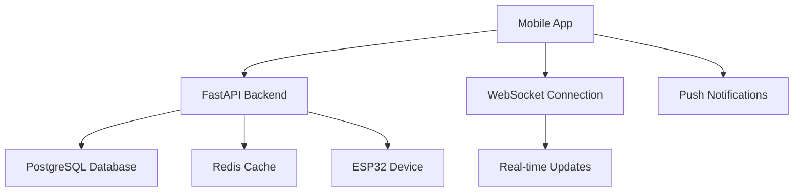

# خطة تطوير تطبيق الهاتف للوالدين
## AI Teddy Bear - Parent Monitoring Mobile App

### 📱 نظرة عامة على المشروع

يحتوي المشروع حالياً على **بنية خلفية متكاملة** مع FastAPI ونظام مراقبة شامل للوالدين عبر الويب، لكنه **لا يحتوي على تطبيقات هاتف أصلية**. هذا يخلق فرصة ذهبية لتطوير تطبيق هاتف متقدم يستفيد من البنية الموجودة.

---

## 🎯 الحاجة لتطبيق الهاتف

### المزايا المطلوبة:
- **إشعارات فورية** للأحداث الأمنية
- **مراقبة مباشرة** لتفاعلات الطفل
- **تحكم سهل** في إعدادات الأمان
- **وصول سريع** من أي مكان
- **تجربة مستخدم محسنة** للهواتف

---

## 🚀 خيارات التطوير المقترحة

### 1. ⭐ React Native (الخيار الأفضل)
```javascript
// مثال على هيكل التطبيق
ParentApp/
├── src/
│   ├── components/
│   │   ├── Dashboard/
│   │   ├── ChildProfile/
│   │   ├── RealTimeMonitor/
│   │   └── SafetyControls/
│   ├── services/
│   │   ├── api.js
│   │   ├── notifications.js
│   │   └── websocket.js
│   └── screens/
│       ├── LoginScreen.js
│       ├── DashboardScreen.js
│       └── MonitoringScreen.js
```

**المزايا:**
- ✅ تطبيق واحد للـ iOS و Android
- ✅ استخدام نفس API الموجود
- ✅ تطوير أسرع وصيانة أسهل
- ✅ مجتمع دعم كبير

**العيوب:**
- ❌ أداء أقل قليلاً من التطبيقات الأصلية
- ❌ قيود في الوصول لبعض ميزات النظام

### 2. 🎯 Flutter
```dart
// هيكل Flutter
lib/
├── models/
│   ├── child_profile.dart
│   └── monitoring_data.dart
├── services/
│   ├── api_service.dart
│   └── notification_service.dart
├── screens/
│   ├── dashboard_screen.dart
│   └── monitoring_screen.dart
└── widgets/
    ├── safety_controls.dart
    └── real_time_chart.dart
```

**المزايا:**
- ✅ أداء ممتاز قريب من الأصلي
- ✅ تطبيق واحد للمنصتين
- ✅ واجهات مستخدم جميلة
- ✅ دعم قوي من Google

### 3. 📱 التطوير الأصلي (Android + iOS)

**Android (Kotlin):**
```kotlin
// هيكل Android
app/src/main/java/com/aiteddy/parent/
├── activities/
│   ├── MainActivity.kt
│   └── MonitoringActivity.kt
├── fragments/
│   ├── DashboardFragment.kt
│   └── SafetyFragment.kt
├── services/
│   ├── ApiService.kt
│   └── NotificationService.kt
└── models/
    └── ChildProfile.kt
```

**iOS (Swift):**
```swift
// هيكل iOS
AITeddyParent/
├── ViewControllers/
│   ├── DashboardViewController.swift
│   └── MonitoringViewController.swift
├── Services/
│   ├── APIService.swift
│   └── NotificationService.swift
└── Models/
    └── ChildProfile.swift
```

---

## 🏗️ البنية التقنية المقترحة

### التكامل مع البنية الموجودة:



### API المطلوبة (موجودة بالفعل):
```python
# endpoints موجودة في المشروع
/api/dashboard/children          # إدارة ملفات الأطفال
/api/dashboard/monitoring        # بيانات المراقبة
/api/dashboard/safety           # إعدادات الأمان
/api/esp32/process-audio        # معالجة الصوت
/api/esp32/device-status        # حالة الجهاز
```

---

## 📋 المميزات المطلوبة في التطبيق

### 1. 🏠 الشاشة الرئيسية
- **لوحة التحكم**: نظرة سريعة على حالة الأطفال
- **التنبيهات الفورية**: إشعارات أمنية مباشرة
- **الإحصائيات**: وقت الاستخدام والتفاعلات

### 2. 👶 إدارة ملفات الأطفال
- **إضافة/تعديل** معلومات الطفل
- **تخصيص الإعدادات** حسب العمر
- **تاريخ التفاعلات** المفصل

### 3. 🔒 مراقبة الأمان
- **المراقبة المباشرة** للمحادثات
- **فلترة المحتوى** وإعدادات الأمان
- **تسجيل الأحداث** الأمنية

### 4. 📊 التقارير والتحليلات
- **تقارير يومية/أسبوعية**
- **تحليل المشاعر** من المحادثات
- **إحصائيات الاستخدام**

### 5. ⚙️ الإعدادات
- **إعدادات الخصوصية**
- **تخصيص التنبيهات**
- **إدارة الحساب**

---

## 🛠️ خطة التنفيذ (React Native)

### المرحلة 1: إعداد المشروع (أسبوع 1)
```bash
# إنشاء مشروع React Native جديد
npx react-native init AITeddyParentApp --template react-native-template-typescript

# تثبيت المكتبات المطلوبة
npm install @react-navigation/native @react-navigation/stack
npm install react-native-async-storage
npm install @react-native-firebase/app @react-native-firebase/messaging
npm install react-native-websocket
npm install axios
npm install react-native-charts-wrapper
```

### المرحلة 2: الواجهات الأساسية (أسبوع 2-3)
```typescript
// مثال على خدمة API
import axios from 'axios';

class APIService {
  private baseURL = 'http://your-fastapi-server.com/api';
  
  async getChildProfiles(): Promise<ChildProfile[]> {
    const response = await axios.get(`${this.baseURL}/dashboard/children`);
    return response.data;
  }
  
  async getMonitoringData(childId: string): Promise<MonitoringData> {
    const response = await axios.get(`${this.baseURL}/dashboard/monitoring/${childId}`);
    return response.data;
  }
}
```

### المرحلة 3: الميزات المتقدمة (أسبوع 4-5)
- تكامل WebSocket للتحديثات المباشرة
- إشعارات Push للتنبيهات
- Charts والتحليلات

### المرحلة 4: الاختبار والنشر (أسبوع 6)
- اختبار شامل على الأجهزة
- تحسين الأداء
- نشر على App Store و Google Play

---

## 🔐 اعتبارات الأمان والخصوصية

### COPPA Compliance:
```typescript
// مثال على التحقق من العمر
interface ChildProfile {
  id: string;
  name: string;
  age: number; // يجب أن يكون 3-13 سنة فقط
  parentConsent: boolean;
  encryptedData: string;
}

class SafetyService {
  validateChildAge(age: number): boolean {
    return age >= 3 && age <= 13;
  }
  
  encryptSensitiveData(data: any): string {
    // تشفير البيانات الحساسة
    return encryptedData;
  }
}
```

### أمان البيانات:
- ✅ تشفير البيانات المنقولة (HTTPS/WSS)
- ✅ حماية المصادقة (JWT Tokens)
- ✅ تشفير البيانات المحلية
- ✅ فلترة المحتوى الصارمة

---

## 📈 المتطلبات التقنية

### الحد الأدنى للأجهزة:
- **Android**: API Level 21+ (Android 5.0)
- **iOS**: iOS 11.0+
- **RAM**: 2GB كحد أدنى
- **التخزين**: 100MB للتطبيق

### التقنيات المطلوبة:
```json
{
  "dependencies": {
    "react-native": "^0.72.0",
    "@react-navigation/native": "^6.1.0",
    "react-native-websocket": "^1.0.0",
    "@react-native-firebase/messaging": "^18.0.0",
    "react-native-keychain": "^8.1.0",
    "react-native-charts-wrapper": "^0.5.0"
  }
}
```

---

## 💰 تقدير التكلفة والوقت

### التطوير:
- **React Native**: 6-8 أسابيع
- **Flutter**: 8-10 أسابيع  
- **Native (Android + iOS)**: 12-16 أسبوع

### الموارد المطلوبة:
- مطور React Native/Flutter: 1-2 شخص
- مصمم UI/UX: 1 شخص
- مهندس Backend: 1 شخص (لتحديث API)

---

## 🎯 الخلاصة والتوصية

### ✅ التوصية: React Native
**لماذا React Native هو الأفضل لهذا المشروع:**

1. **التكامل السلس** مع Backend FastAPI الموجود
2. **تطوير أسرع** لكلا المنصتين معاً
3. **توفير التكلفة** مقارنة بالتطوير الأصلي
4. **صيانة أسهل** وتحديثات موحدة

### 🚀 الخطوات التالية:
1. **إعداد بيئة التطوير** React Native
2. **تصميم واجهات المستخدم** الأولية
3. **تطوير نموذج أولي** للميزات الأساسية
4. **اختبار التكامل** مع API الموجود
5. **التطوير التدريجي** للميزات المتقدمة

### 📞 هل تريد البدء؟
يمكننا البدء فوراً في تطوير التطبيق! المشروع جاهز تماماً لإضافة تطبيق الهاتف، والبنية التحتية موجودة ومكتملة.

**ما رأيك؟ هل تريد أن نبدأ بإنشاء النموذج الأولي لتطبيق React Native؟**
