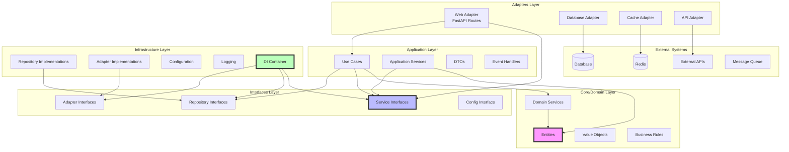

# Clean Architecture Diagram

## Layer Dependencies (After Refactoring)



## Dependency Rules

### ✅ Allowed Dependencies

1. **Core Layer**
   - No dependencies on other layers
   - Only standard library imports

2. **Application Layer**
   - Can depend on Core layer
   - Can depend on Interfaces layer
   - No infrastructure dependencies

3. **Infrastructure Layer**
   - Can depend on Interfaces layer only
   - Implements interfaces defined in Interfaces layer

4. **Adapters Layer**
   - Can depend on Application layer
   - Can depend on Interfaces layer
   - No direct infrastructure dependencies

5. **Interfaces Layer**
   - No dependencies on other layers
   - Defines contracts only

### ❌ Forbidden Dependencies

1. Core → Any other layer
2. Application → Infrastructure
3. Infrastructure → Application
4. Infrastructure → Core
5. Adapters → Infrastructure
6. Interfaces → Any other layer

## Implementation Strategy

### 1. Dependency Injection Container
```python
# infrastructure/container.py
container = ApplicationContainer()
container.wire(modules=[...])
```

### 2. Service Registration
```python
# All services registered with interfaces
auth_service = providers.Factory(
    'src.application.services.auth.AuthService',
    config=configuration_service
)
```

### 3. Usage in Adapters
```python
# adapters/web.py
@inject
def get_service(
    service: IService = Provide[ApplicationContainer.service]
) -> IService:
    return service
```

## Benefits

1. **No Circular Dependencies**: Each layer only depends on layers below it
2. **Testability**: Easy to mock interfaces for testing
3. **Flexibility**: Can swap implementations without changing business logic
4. **Maintainability**: Clear separation of concerns
5. **Scalability**: New features can be added without affecting existing code